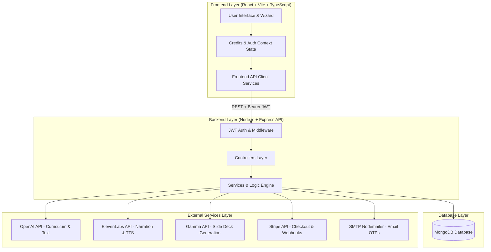
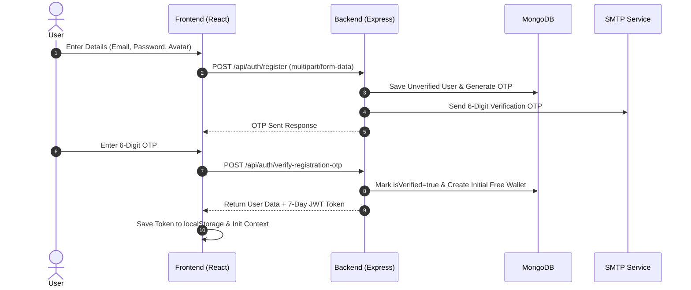
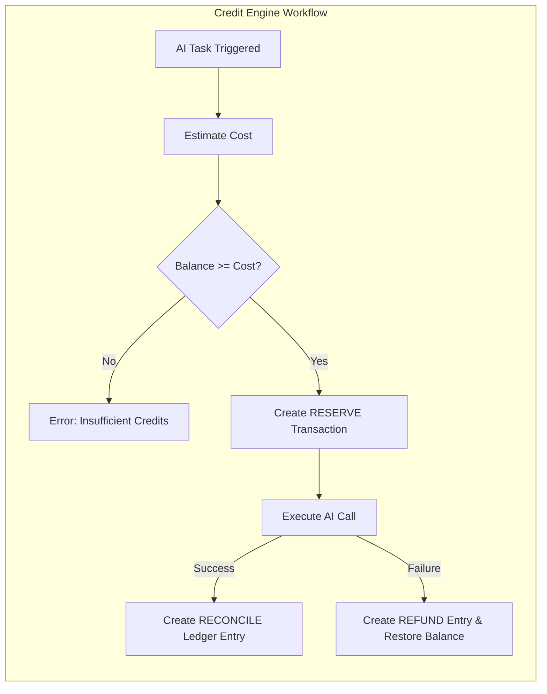
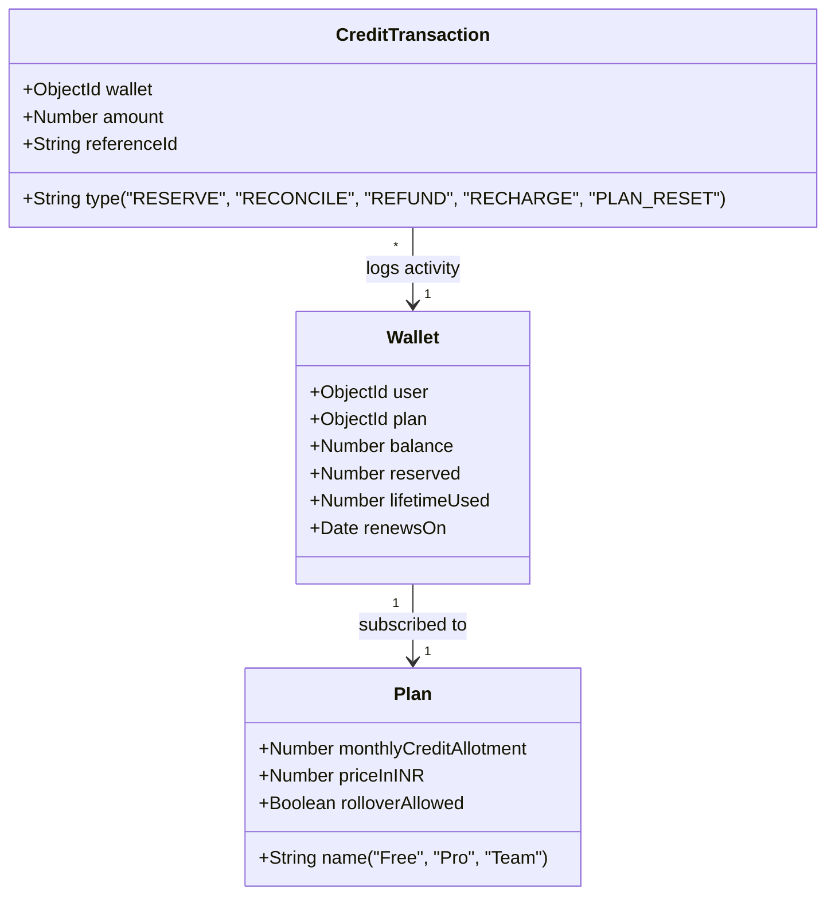
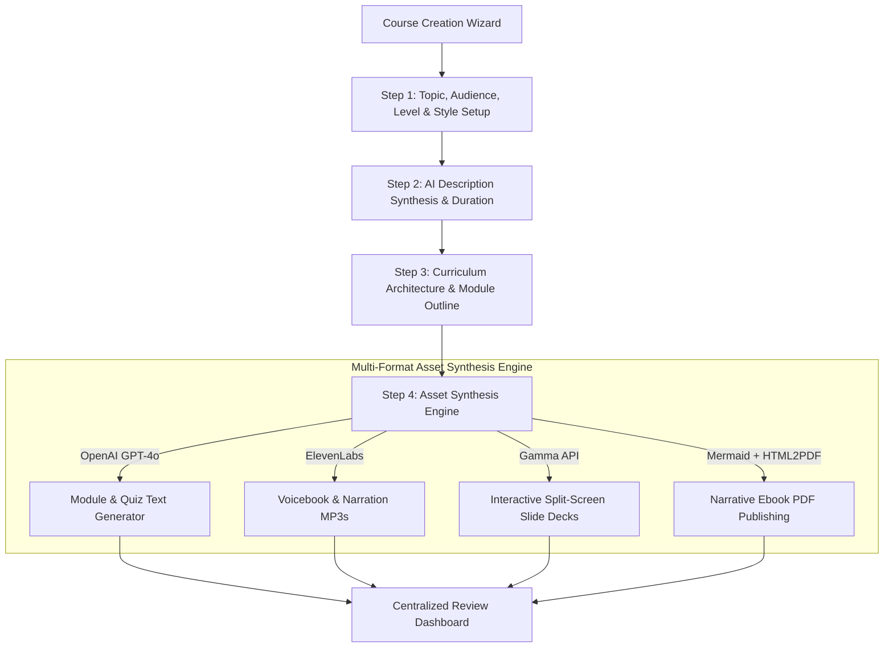

# Orion Course Creator — Comprehensive System Architecture

This document provides a complete technical blueprint of the **Orion Course Creator** platform, detailing its system components, authentication mechanics, credit & wallet engine, subscription plan models, recharge workflows, AI generation pipelines, database schemas, and API interfaces.

---

## 1. High-Level System Architecture

Orion is built using a modern **Decoupled Client-Server Monorepo** pattern:



---

## 2. Authentication System Architecture

Authentication is stateless and uses **JSON Web Tokens (JWT)** combined with **OTP Email Verification** for signup security and password recovery.



### Key Auth Features & Endpoints

| Endpoint | Method | Authentication | Description |
| :--- | :--- | :--- | :--- |
| `/api/auth/register` | `POST` | Public | Registers user, hashes password with Bcrypt, sends OTP email. |
| `/api/auth/verify-registration-otp` | `POST` | Public | Verifies signup OTP, activates user, initializes Free Credit Wallet. |
| `/api/auth/login` | `POST` | Public | Authenticates credentials, issues 7-day JWT. |
| `/api/auth/forgot-password` | `POST` | Public | Sends 6-digit password reset OTP (1-hour expiry). |
| `/api/auth/reset-password` | `POST` | Public | Resets password upon valid OTP input. |
| `/api/auth/change-password` | `POST` | Bearer JWT | Authenticated password change requiring current password verification. |
| `/api/auth/user` | `GET` | Bearer JWT | Fetches profile metadata and active wallet reference. |
| `/api/auth/profile/avatar` | `POST` | Bearer JWT | Updates user profile image. |

---

## 3. Credit Wallet & Pricing Engine

Orion uses a **Unit-Based Credit System** to meter and control resource consumption across AI generation services (OpenAI, ElevenLabs, Gamma).



### Credit Pricing Rules (`PricingRule` Model)

| Action Key | Provider | Credit Cost | Description |
| :--- | :--- | :--- | :--- |
| `Generate Course` | OpenAI | 250 credits | Complete end-to-end course generation. |
| `Generate Course Outline` | OpenAI | 10 credits | Curriculum module structure & lesson titles. |
| `Generate Module` | OpenAI | 20 credits | Full section content generation. |
| `Generate Quiz / Assessment` | OpenAI | 8 credits | Quizzes and interactive assessments. |
| `Generate Questions` | OpenAI | 5 credits | Individual question synthesis. |
| `Generate Podcast / Voiceover` | ElevenLabs | 15 credits/min | Studio voicebook narration generation. |
| `Generate Slide Deck` | Gamma | 50 credits | AI presentation slide orchestration. |

---

## 4. Subscription Plans & Recharge System

Users can access credits via **Monthly Subscription Plans** or **One-Time Credit Top-Ups**.



### Subscription Tiers

| Tier Name | Monthly Credits Allotment | Price (INR) | Credit Rollover |
| :--- | :--- | :--- | :--- |
| **Free** | 1,000 credits / mo | ₹0 | No |
| **Pro** | 8,000 credits / mo | ₹499 | Yes |
| **Team** | 15,000 credits / mo | ₹1,499 | Yes |

### Credit Top-Up Packages

| Package ID | Credits Added | Price | Badge / Popularity |
| :--- | :--- | :--- | :--- |
| `pkg-100` | 100 credits | $9 | Standard |
| `pkg-500` | 500 credits | $39 | Most Popular ⭐ |
| `pkg-1000` | 1,000 credits | $69 | Value Pack |
| `pkg-5000` | 5,000 credits | $249 | Enterprise Pack |

### Wallet API Endpoints (`/api/wallet`)

* `GET /api/wallet/`: Fetch current wallet balance, reserved credits, and active plan details.
* `GET /api/wallet/transactions/`: Fetch paginated audit ledger of all credit movements.
* `POST /api/wallet/estimate/`: Preview credit cost for an action key prior to execution.
* `POST /api/wallet/recharge/`: Execute a credit package top-up.
* `POST /api/wallet/recharge/stripe-session/`: Create Stripe checkout session for credit top-up.
* `GET /api/wallet/plans/`: Fetch all available subscription tiers.
* `POST /api/wallet/plans/subscribe/`: Upgrade or downgrade user plan.
* `POST /api/wallet/plans/stripe-session/`: Create Stripe checkout session for plan subscription.

---

## 5. Course & Asset Generation Pipeline



---

## 6. Frontend Architecture & State Management

```
frontEnd/src/
├── App.tsx                     # Main Router & Provider Tree
├── contextAPI/
│   └── CreditsContext.tsx      # Global Wallet, Balance & Transaction State
├── services/
│   ├── walletService.ts        # Unified Wallet & Plan Client API
│   ├── rechargeService.ts      # Credit Package Top-up Client API
│   ├── planService.ts          # Subscription Plan Client API
│   └── aiService.ts            # Course Generation Client API
├── pages/
│   ├── AddCreditsPage.tsx      # Credit Top-up & Subscription Page
│   ├── CourseCreatorPage.tsx   # Step-by-Step Wizard Page
│   └── EbookPreviewPage.tsx    # Ebook PDF Reader Page
└── components/
    ├── credits/                # Plan Cards, Credit Package Cards, Billing Modals
    └── CourseCreator/          # Step Form Components & Slide Generators
```

---

## 7. Database Models Summary

1. **User Model (`userModel.js`)**: User identity, password hash, verification state, avatar URL, notifications array.
2. **Wallet Model (`wallet.js`)**: Linked 1-to-1 with User. Stores credit `balance`, `reserved` amount, `lifetimeUsed`, and `renewsOn` date.
3. **Plan Model (`plain.js`)**: Defines `Free`, `Pro`, `Team` tiers with monthly allotments and pricing.
4. **PricingRule Model (`pricingRule.js`)**: Maps action keys (`Generate Course`, `Generate Slide Deck`, etc.) to credit costs.
5. **CreditTransaction Model (`creditTransaction.js`)**: Immutable audit log recording every credit addition, reservation, deduction, or refund.
6. **Course Model (`courseModel.js`)**: Stores curriculum hierarchy, modules, lessons, style configurations, and generated asset metadata.
